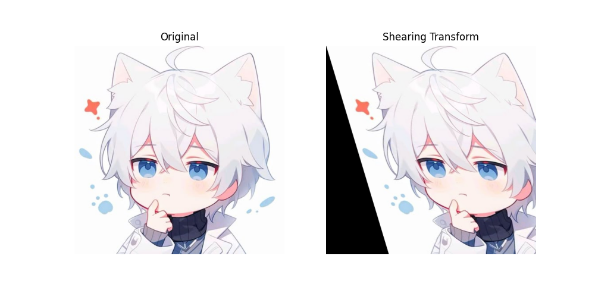

# Python-Programming-Projection

## Instalasi Python
- Unduh Python versi terbaru dari [website resmi Python](https://www.python.org/downloads/)
- Pastikan untuk mencentang opsi "Add Python to PATH" saat instalasi agar Python dapat diakses dari terminal/CMD
- Verifikasi instalasi dengan menjalankan perintah di terminal/CMD :

```python --version```

atau 

```python3 --version```


## Instalasi Library

Jalankan perintah berikut di terminal/CMD untuk menginstal library yang dibutuhkan

```pip install numpy matplotlib opencv-python``` 

Jika menggunakan Python 3 dan pip3 :

```pip3 install numpy matplotlib opencv-python```


## Mengunduh File dari Repositori
- Buka terminal/CMD dan jalankan perintah berikut untuk mengklon 
[Repositori](https://github.com/Mikaelaazz/Python-Programming-Projection.git)

- Jika tidak memiliki Git, unduh langsung dari [Github]() dalam format ZIP dan Ekstrak File ZIP tersebut

## Panduan Pengguna 

#### 1. Menyiapkan Gambar
- Siapkan gambar yang ingin diproses di folder yang sama dengan file Python.
- Edit Path Gambar di dalam kode sebelum menjalankannya. Contoh :

```img = cv2.imread(r'namagambar.jpg')```

atau 

```img = cv2.imread(r'C:\path\ke\gambar.jpg')```

#### 2. Menjalankan File
- Buka terminal/CMD di folder tempat file disimpan
- Jalankan script dengan perintah

```python namafile.py```

contoh

```python translation.py```


## Output
### 1. Projection Image
- Translation
 
- Rigid
 
- Similarity
 
- Affine
 
- Projective
 
- Scaling
 
- Shearing
 
- Reflection
 

### 2. Histogram
- Histogram
 

### 3. Color Conversion
- Color Conversion
 
