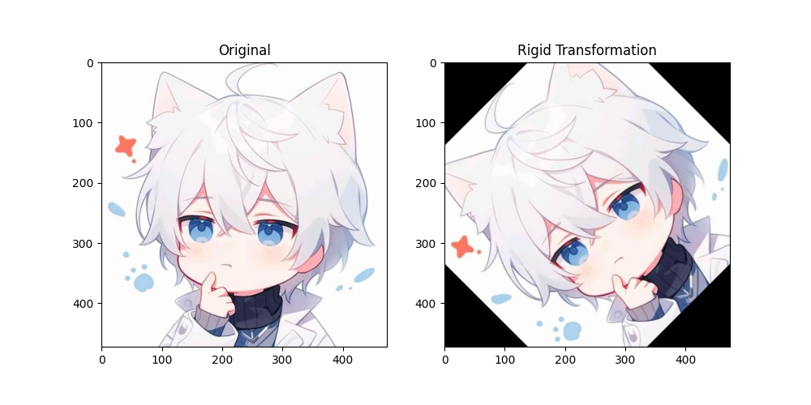
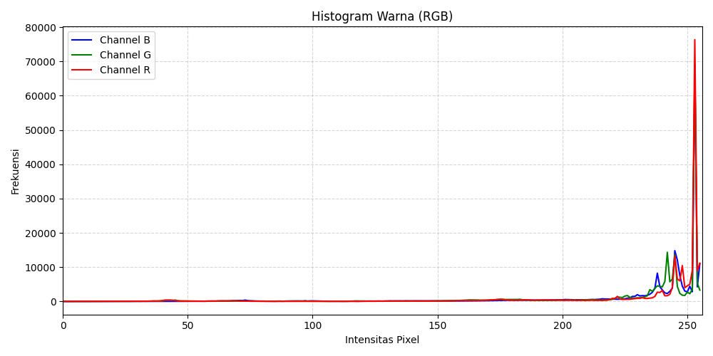

# Python-Programming-Projection

## Usage
`Install Python`
[Download Python](https://www.python.org/downloads/)
`Next Install Library`
```pip install numpy matplotlib opencv``` 

## Running File
[Git Clone](https://github.com/Mikaelaazz/Python-Programming-Projection.git)
`Buka File yang sudah kamu download dari github ini `
`Buka IDE yang anda gunakan sehari hari`

`Lalu pilih file yang anda inginkan`
- Pastikan Library telah terinstall jika belum maka lakukan cara seperti USAGE
- Sebelum running pastikan anda telah melokasikan gambar sesuai dengan lokasi file anda
```py img = cv2.imread(r'path image')```

- Jalankan file yang anda inginkan dengan syntax
```py namafile.py```

`OUTPUT`
### Projection Image
- Translation
 
- Rigid
 
- Similarity
 
- Affine
 
- Projective
 
- Scaling
 
- Shearing
 
- Reflection
 

### Histogram
- Histogram
 

### Color Conversion
- Color Conversion
 
